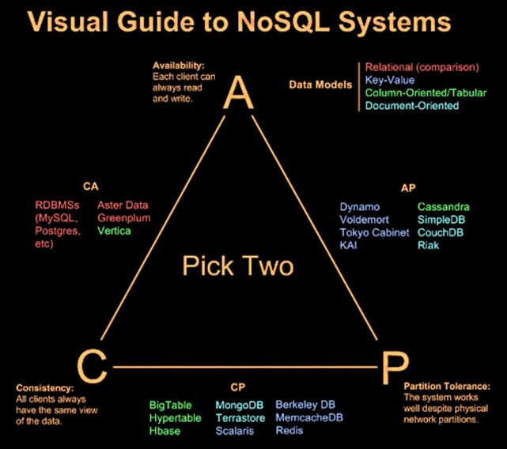

# 1. Inhoud
- [1. Inhoud](#1-inhoud)
- [2. Document historie](#2-document-historie)
- [3. Inleiding](#3-inleiding)
  - [3.1. Overzicht](#31-overzicht)
  - [3.2. Doel van het onderzoek](#32-doel-van-het-onderzoek)
  - [3.3. Onderzoeksvragen](#33-onderzoeksvragen)
- [4. Scope](#4-scope)
- [5. Onderzoek](#5-onderzoek)
- [6. Referenties](#6-referenties)

# 2. Document historie

| Versie | Veranderingen                                                                                  | Datum      |
| -----: | ---------------------------------------------------------------------------------------------- | ---------- |
|    0.1 | Eerste opzet document                                                                          | 30-05-2022 |

# 3. Inleiding

## 3.1. Overzicht

Om het leerdoel distributed data aan te tonen en bij te dragen aan het leerdoel context based research zullen wij (Rick & Ruben) samen een context based research doen over het onderwerp distributed data.

## 3.2. Doel van het onderzoek

PANNEKOEK

## 3.3. Onderzoeksvragen

**Hoofdvraag:**

Hoe kan data gedistribueerd worden op basis van een microservice architectuur?

**Onderzoeksvragen:**
1. Hoe verschilt distributed data tussen een microservice architectuur en een standaard MVC architectuur?
   -  
2. Wat is de 3 V's van data?
3. Distributed Data specifieke garanties?
4. Welke modellen zijn toepassbaar op distributed data?

# 4. Scope

De scope van het onderzoek is om te onderzoeken wat Distributed Data exact is en wat het kan bieden in de praktijk. Wat zijn de toepassingen van distributed data? Wat is de toegevoegde waarde van Distributed Data? en hoe zijn deze praktijken toe te passen? In dit onderzoek zal dan ook alleen Distributed Data aanbod komen.

# 5. Onderzoek

**Hoe verschilt distributed data tussen een microservice architectuur en een standaard MVC architectuur?**

**Wat is de 3 V's van data?**

***Cloud***

Vandaag de dag groeit de "cloud" enorm. Maar wat is cloud?
Cloud is de naam die engineers gegeven hebben aan de leegte tussen LAN's in netwerktekeningen, ook wel "The undefined stuff in between".
Het internet is ondertussen het grootste "The undefined stuff in between" ooit geworden, de cloud dus.

Big Data is ook een vaag woord dat veel gebruikt wordt maar wat is dat?
Net zoals bijna alles in de tech sector hangt dat af van hoe je het bekijkt. 
Je kan Big Data kan gezien worden als data dat te groot is voor traditioneel data management om mee om te gaan.

Big Data wordt beschreven volgens de 3 V's
1. Volume
2. Velocity
3. Variety

***Volume***
Volume is de v die het meest verwant is met big data. Bij volume praten we over de kwantiteit van data dat kan oplopen tot onhandelbare getallen.
Data komt vanuit allerlij kanten en de hoeveelheid data op de wereld groeit meer en meer.
Denk bijvoorbeeld aan de hoeveelheid IoT (Internet of things) devices die aangesloten zijn en elk moment van de dag data produceren

***Velocity***
Velocity is de 2e 'V' die big data beschrijft.
Als voorbeeld: Facebook gebruikers uploaden cummulatief 900 miljoen fotos per dag!

Velocity beschrijft de snelheid waarmee data geproduceerd wordt.

***Variety***
De 3e V staat voor variety. De data die voorkomt in de wereld is of zijn niet alleen maar rows en columns zoals dat jaren geleden was. Dat betekend dat niet alle data goed past in een spreadsheet of database applicatie. 

***De 3 V's managen***
Er zijn ontelbare manieren om de 3 V's te managen, maar de grootste vuistregel waar je aan vast kan houden is: Wanneer je praat over data en termen die verder gaan dan buckets, wanneer je begint te praten over epic kwantiteiten, grote flow en een wijd assortiment, dan heb je het over big data.

Een laatste gedachtegang: er zijn mannieren om big data uit te pluizen en inzicht te geven dat toegepast kan worden op het oplossen van problemen en herkennen van kansen. Dat process wordt analytics genoemd. Daarom hoor je vaak als er gepraat wordt over big data, ook de term analytics in dezelfde zin.

De 3 V's beschrijven data die geanalyzeerd kan worden (het process waar je waarde uit data haalt). Alles bij elkaar genomen is er het potentieel voor erbazingwekkend inzicht of zorgwekkend overzicht. Net als bij elke grote kracht komt er ook bij big data een grote belofte en verantwoordelijkheid kijken.

**Distributed Data specifieke garanties?**

Op het gebied van databases zijn relational databases al bekend, waarin transacties worden gebruikt om updates van informatie te verwerken. Als er in grote hoeveelheden data/gegevens worden bijgewerkt kan dit een uitdaging zijn om de inhoud van de database(s) in een geldige staat te houden. Om te voorkomen dat data wordt verloren kan er een mechanisme worden gebruikt om de transacties te valideren. Het mechanisme wat dan toegepast kan worden, wordt ook wel het ACID-principe genoemd. Het ACID-principe is een principe dat gebruikt wordt om de transacties van een database te valideren.

***ACID principe***

Als er een bank account is waarvan $100 van account A naar account B wordt overgemaakt moeten er twee transacties worden gedaan.

1. Haal $100 van account A
2. Geef $100 aan account B

Tijdens het uitvoeren van deze stappen kan er echter een aantal dingen misgaan. Bijvoorbeeld:

- De applicatie op de server kan crashen na stap 1
- De database kan crashen tijdens stap 2
- Twéé personen kunnen dezelfde transactie doen

Het ACID principe is een principe dat gebruikt wordt om de transacties van een database te valideren en staat voor:

- **Atomicity:** Als een reeks bewerkingen wordt gestart als een transactie, slaagt alles of niets. Als het bijvoorbeeld wordt geactiveerd als onderdeel van een transactie, worden zowel stap 1 als stap 2 bij het overboeken van die $100 van rekening A naar B van kracht, indien succesvol, of beide falen. Er zal geen gedeeltelijke transactie worden gemaakt.
- **Consistency:** Een ID van een medewerker binnen een organisatie moet voor iedereen uniek zijn. Elke medewerker moet een afdeling hebben waar de medewerker bij hoort. De eigenschap Consistency zorgt ervoor dat deze feiten altijd behouden blijven. Relational databases zorgen ervoor dat het gebruik maakt van unieke sleutels.
- **Isolation:** Het betekent dat een lopende transactie niet mag worden gezien of gezien door andere gelijktijdig lopende transacties. Het zou anders nooit in staat zijn om de staat terug te zetten naar het begin.
- **Durability:** Eeenmaal committed, mogen de updates van een transactie niet verloren gaan. Databasesystemen maken hiervoor gebruik van write-ahead logs, harde schijven, back-ups, enz.

***CAP theorem***

Het CAP theorem bestaat uit drie componenten omdat ze betrekking hebben op distributed data opslag:

- **Consistency:** betekend dat alle clients dezelfde versie van de data hebben.
- **Availability:** betekend dat alle clients bij het maken van een verzoek, altijd een antwoord krijgen.
- **Partition tolerence:** betekend dat het cluster moet blijven werken ondanks communicatiestoringen tussen knooppunten.

NoSQL (non-relational) databases zijn ideaal voor distributed netwerk applicaties. In tegenstelling tot hun verticaal schaalbare SQL (relational) tegenhanger, zijn NoSQL-databases horizontaal schaalbaar en worden ze door ontwerp gedistribueerd.

NoSQL-databases worden geclassificeerd op basis van de twéé CAP-kenmerken die ze ondersteunen:

- **CP Databases:** Een CP database levert consistentie en partition-tolerence ten koste van beschikbaarheid. Wanneer een partitie optreed tussen twee willekeurige knooppunten, moet het systeem het niet-consistente knooppunt afsluiten.
- **AP Databases:** Een AP database levert beschikbaarheid en partition-tolerence ten koste van consistentie. Wanneer een partitie optreedt, blijven alle knooppunten beschikbaar, maar die aan het verkeerde uiteinde van een partitie kunnen een oudere versie van gegevens ontvangen.
- **CA Databases:** Een CA database zorgt voor consistentie en beschikbaarheid op alle knooppunten. Het kan dit echter niet doen als er een partitie is tussen twee willekeurige knooppunten in het systeem.

    

***Conclusie***

**Welke modellen zijn toepassbaar op distributed data?**

# 6. Referenties

**ACID Principe**
- [https://medium.com/@pranabj.aec/acid-cap-and-base-cc73dee43f8c](https://medium.com/@pranabj.aec/acid-cap-and-base-cc73dee43f8c)
- 

**CAP Theorem**

- [https://www.bmc.com/blogs/cap-theorem/](https://www.bmc.com/blogs/cap-theorem/)
- [https://www.ibm.com/cloud/learn/cap-theorem](https://www.ibm.com/cloud/learn/cap-theorem)
- [https://en.wikipedia.org/wiki/CAP_theorem](https://en.wikipedia.org/wiki/CAP_theorem)
- [https://fhict.instructure.com/courses/12090/pages/gdpr-and-data-complexities-theoretical-background?module_item_id=751978](https://fhict.instructure.com/courses/12090/pages/gdpr-and-data-complexities-theoretical-background?module_item_id=751978)