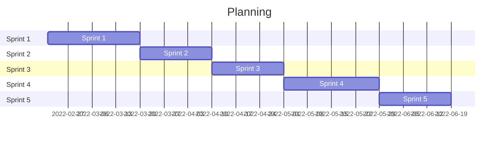

# 1. Contents

- [1. Contents](#1-contents)
- [2. Document historie](#2-document-historie)
- [3. Begrippenlijst](#3-begrippenlijst)
- [4. Projectopdracht](#4-projectopdracht)
  - [4.1 Probleemstelling](#41-probleemstelling)
  - [4.2 Doel van het project](#42-doel-van-het-project)
  - [4.3 Begrenzing en Randvoorwarden](#43-begrenzing-en-randvoorwarden)
  - [4.4 Strategie](#44-strategie)
  - [4.5 Succesfactoren](#45-succesfactoren)
  - [4.6 Belangrijke data](#46-belangrijke-data)
  - [4.7 Onderzoeksplan](#47-onderzoeksplan)
  - [4.8 Onderzoeksvragen](#48-onderzoeksvragen)
    - [4.8.1 Hoofdvraag](#481-hoofdvraag)
    - [4.8.2 Deelvragen](#482-deelvragen)
  - [4.9 Eindproducten](#49-eindproducten)
- [Referenties](#referenties)

# 2. Document historie

| Versie | Veranderingen         | Auteur     | Datum     |
| -----: | --------------------- | ---------- | --------- |
|    0.1 | Eerste opzet document | Rick Meels | 07-3-2022 |

# 3. Begrippenlijst

| Begrip   | Omschrijving                                                                                                                                                                                                                                           |
| -------- | ------------------------------------------------------------------------------------------------------------------------------------------------------------------------------------------------------------------------------------------------------ |
| Big Data | Big data of massadata zijn gegevensverzamelingen (datasets) die te groot en te weinig gestructureerd zijn om met reguliere databasemanagementsystemen te worden onderhouden.[1](#referenties)                                               |
| DevOps   | DevOps, een combinatie van ontwikkeling (Dev) en bedrijfsactiviteiten (Ops), is de samenstelling van mensen, processen en technologie om doorlopend waarde aan klanten te bieden.[2](#referenties)                                          |
| CI/CD    | Continuous Integration (CI) en Continuous Delivery (CD) is de benaming voor een manier van werken binnen software teams, waarbij de afhandeling van codewijzigingen wordt gedaan door een aantal geautomatiseerde stappen.[3](#referenties) |

# 4. Projectopdracht

## 4.1 Probleemstelling

Momenteel zijn er veel mensen die hun foto's en/of video's kwijt willen, maar het liever niet willen plaatsen op de servers van een van de grote corperaties (ex. Facebook, Instagram, Twitter, etc.). Dit heeft te maken dat grote corperaties gebruik maken van de geplaatste content en zo een profiel van jou kunnen maken en gerichter kunnen adverteren.

Daarom moet er een oplossing komen waar grote corperaties niet bij kunnen en dus geen [Big Data](#3-begrippenlijst) verzamelen. Om dat probleem te verhelpen moet er een nieuw onafhankelijk product worden gebouwd. Dit product moet een webapplicatie zijn die gebruikers kunnen gebruiken om content te plaatsen om zo te delen met andere gebruikers.

## 4.2 Doel van het project

Om dit probleem te verhelpen moet er een nieuw onafhankelijk product worden gebouwd. Dit product gaat de naam [Delaygram](https://delaygram.nl/) krijgen. 

[Delaygram](https://delaygram.nl/) is een softwarepakket voor eindgebruikers die een makkelijke en eenvoudige manier zoeken om foto’s en/of korte video’s te delen met hun vrienden of volgers. Hiermee betrek je je dagelijkse volgers of vrienden in de leuke activiteiten, plaatjes of filmpjes die jij hebt gemaaktof gedaan.

Het project zal bestaan uit een webapplicatie die te gebruiken is voor gebruikers die plaatjes of filmpjes willen posten op het platform. Een mobiele app is nog een discussie over of deze gerealiseerd zal worden. 
De te gebruiken technieken staan nog niet van tevoren vast, hier zal tijdens het project voor gekozen worden. Er is ook een mogelijkheid om verschillende technieken door elkaar heen te gebruiken.

## 4.3 Begrenzing en Randvoorwarden

| Tot het project behoort:                                    | Tot het project behoort niet: |
| ----------------------------------------------------------- | ----------------------------- |
| 1. Analyse en onderzoek                                     | 1.                            |
| 2. Ontwerp en ontwikkeling                                  |                               |
| 3. Implementatie                                            |                               |
| 4. Testen                                                   |                               |
| 5. Planning                                                 |                               |
| 6. [DevOps](#3-begrippenlijst) ([CI/CD](#3-begrippenlijst)) |                               |

## 4.4 Strategie

Het project is in grote lijnen volgens het waterval principe. De keuze voor een waterval methodiek is gemaakt op basis van de scope van het project. Het project zal een vaststaande scope hebben voor de gehele ontwikkelfase en zullen tijdens het verloop van het project niet of nauwelijks aangepast worden.

- **Probleemdefinitiefase**
  - In deze fase wordt er onderzoek gedaan naar de inhoud van de gegeven opdracht. Op basis van het onderzoek kan er een verwachting geschetst worden voor de op te leveren product(en).

- **Analysefase**
  - In deze fase zal er gewerkt worden aan het Requirements Analyse Document (RAD) om een basis te vormen voor een goed projectresultaat en zullen er onderzoeken worden opgesteld. Deze onderzoeken zullen tijdens de loop van het project duidelijkheid moeten schetsen en de uiteindelijke onderzoeksvragen beantwoorden.
- **Designfase**
  - In deze fase zal er een Software Architectuur Document (SAD) en een Systeemtestplan gemaakt worden. Met een SAD wordt een duidelijk beeld creëren hoe de applicatie op de achtergrond eruit gaat zien, daarnaast zal het testplan gemaakt worden om een duidelijk beeld te krijgen hoe en waar in de applicatie getest zal worden. Verder zal er een begin worden gemaakt aan de applicatie zelf.
- **Implementatiefase**
  - Deze fase zal grotendeels de focus liggen op het maken en implementeren van de al hiervoor beschreven software architectuur. Tijdens de implementatie zal de applicatie grondig getest worden op basis van unittests, code analysis en code reviews.
- **Afrondingsfase**
  - In deze fase zullen de laatste wijzigingen en puntjes op de “i” worden gezet, denk hierbij aan bug fixes, laatste features, documentatie, portfolio en dergelijke. 

## 4.5 Succesfactoren

Om het project succesvol te laten slagen moet er voldaan worden aan alle acceptatiecriteria van de individuele user stories. Naast deze acceptatiecriteria zijn er nog een aantal andere factoren die bepalen of het project succesvol is of niet:

- Zorg dat gebruikers makkelijk content kunnen uploaden doormiddel van een uploadservice.
- Maak het overbodig voor gebruikers om eindeloos te zoeken op de webapplicatie.
- Maak het product responsive om ervoor te zorgen dat verzoeken niet te lang duren.

## 4.6 Belangrijke data

Naast alle planningen zijn er belangrijke data die eventueel invloed kunnen hebben op het project.

| Datum      | Gebeurtenis                                                                                                |
| ---------- | ---------------------------------------------------------------------------------------------------------- |
| 20-02-2022 | [Project Pitch](https://fhict.instructure.com/courses/12090/modules/items/751927)                          |
| 13-03-2022 | [Emerging Trends Research: Plan](https://fhict.instructure.com/courses/12090/modules/items/751924)         |
| 20-03-2022 | [Sprint 1](https://fhict.instructure.com/courses/12090/modules/items/751928)                               |
| 10-04-2022 | [Sprint 2](https://fhict.instructure.com/courses/12090/modules/items/751929)                               |
| 01-05-2022 | [Sprint 3](https://fhict.instructure.com/courses/12090/modules/items/751930)                               |
| 29-05-2022 | [Sprint 4](https://fhict.instructure.com/courses/12090/modules/items/751931)                               |
| 12-06-2022 | [Emerging Trends Research: Deliverables](https://fhict.instructure.com/courses/12090/modules/items/751925) |
| 19-06-2022 | [Sprint 5](https://fhict.instructure.com/courses/12090/modules/items/751932)                               |
| 19-06-2022 | [Final delivery of documents and code](https://fhict.instructure.com/courses/12090/modules/items/751933)   |

## 4.7 Onderzoeksplan

Alle onderzoeken zullen uitgevoerd worden met de Methode Toolkit HBO-i. Dit framework biedt gebruikers de mogelijkheid geschikte onderzoeksmethoden te selecteren, geeft aanwijzingen voor het gebruik en wijst naar geschikte bronnen om meer diepgang te geven.

Voor een beschrijving van de onderzoeksmethodes, vindt hier onder een korte beschrijving van de verschillende methodes.

| Image                                      | Beschrijving                                                                                                                                                                                                                                                      |
| ------------------------------------------ | ----------------------------------------------------------------------------------------------------------------------------------------------------------------------------------------------------------------------------------------------------------------- |
|    | De library onderzoeksstrategie wordt gebruikt al om al bestaande theorieën en richtlijnen te verkennen. Die verder kunnen helpen het onderzoek te ondersteunen.                                                                                                   |
|         | De field onderzoeksstrategie wordt gebruikt om de applicatie context te verkennen. Deze strategie wordt gebruikt om de behoeftes, verlangens en beperkingen van de eindgebruikers te leren kennen.                                                                |
|             | De lab onderzoeksstrategie wordt gebruikt om onderdelen of concepten van het product te testen. Deze strategie wordt gebruikt om erachter te komen of onderdelen werken zoals ze bedacht zijn of om verschillende scenario’s te testen.                           |
|  | De showroom onderzoeksstrategie wordt gebruikt om ideeën in relatie met al bestaand werk te testen. Het tonen van een prototype aan experts kan een vorm van showroom onderzoek zijn of het pitchen waarom een project anders is dan de rest van de concurrentie. |
|  | De workshop onderzoeksstrategie wordt gebruikt om kansen te verkennen. Prototyping, designen en co-creatie zijn manieren om inzicht te krijgen in wat mogelijk is en hoe bepaalde dingen kunnen functioneren.                                                     |

## 4.8 Onderzoeksvragen

In de opdracht komen veel technieken en werkwijzen aan bod. De opdracht werkt meerdere deelvragen uit. Een groot deel van de strategieën van het onderzoeks framework zijn toepasbaar tijdens dit project.

### 4.8.1 Hoofdvraag

Hoe kan [Delaygram](https://delaygram.nl/) functioneren als een integraal geheel, gebaseerd op een enterprice architectuur?

### 4.8.2 Deelvragen

1. Hoe wordt de webapplicatie beschikbaar gesteld aan de eindgebruiker in de cloud?
   - Welke services zijn nodig om de applicatie beschikbaar te kunnen stellen in de cloud?
2. Wat is de cloud?
   - Wat is serverless?
   - Wat zijn lambdas?
   - Wat is een API gateway?
3. Hoe wordt een applicatie beschikbaar gesteld via Kubernetes?
   - Wat is k8s?
   - Hoe applicaties te schalen?

## 4.9 Eindproducten

Hieronder bevindt zich een kort overzicht over de producten die tijdens de stage opgeleverd zullen worden. Daarnaast staat een korte beschrijving over hoe de specifieke onderdelen gerealiseerd zullen worden.

- **Projectplan**
  - Dit document. Het projectplan beschrijft hoe het project zal verlopen.

- **Portfolio**
  - Het portfolio bevat alle documenten en software die tijdens de verloop van het project gemaakt zijn en omschrijft het gehele proces. Denk hierbij aan de analyse, ontwerp, realisatie en test fases waarbij er constant gereflecteerd wordt op de uitvoering.

- **Analysedocument**
  - Onderdeel van de analysefase is een analysedocument. Hier wordt gekeken naar de eisen, wensen en succesfactoren van het project.

- **Architectuurdocument**
  - Tijdens de ontwerpfase wordt het architectuurdocument opgesteld om een goed beeld te krijgen van hoe de software en onderlinge communicatie er technisch uit gaat zien.

- **Testplan**
  - Voor de testfase wordt er een testplan opgesteld waarin tests beschreven staan die de software moet ondergaan. Deze tests zijn zowel functioneel als niet-functioneel. Het testrapport wordt aan de hand van tests ingevuld waarna bepaald wordt of het project succesvol is geweest.

- **Onderzoeksresultaten**
  - Een groot deel van het project is het doen van onderzoek. In dit document worden alle uitgevoerde onderzoeken toegelicht met resultaten en reflecties.

- **Eindapplicatie**
  - Een eindprocut van de delaygram applicatie.

# Referenties

1. Wikipedia contributors. (2022, February 25). Big data. *In Wikipedia, The Free Encyclopedia.* Retrieved 10:23, March 7, 2022, from https://en.wikipedia.org/w/index.php?title=Big_data&oldid=1073925279
2. DevOps. *Microsoft Azure.* Retrieved 11:44, March 7, 2022, from https://azure.microsoft.com/nl-nl/overview/what-is-devops/
3. ElasticWeb. (2020, November 27). CI/CD. *Elastic Web.* Retrieved 11:48, March 7, 2022, https://www.elasticweb.nl/kennisbank/continuous-integration-en-continuous-delivery-verder-uitgelegd