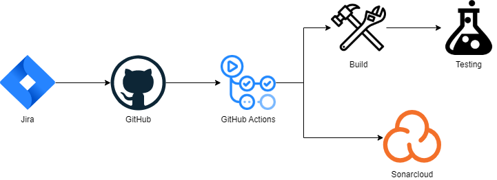
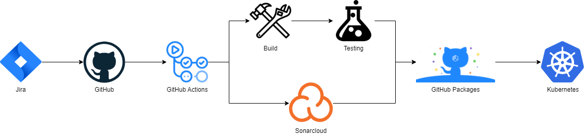

# 1. Contents

- [1. Contents](#1-contents)
- [2. Delaygram software](#2-delaygram-software)
- [3. Document historie](#3-document-historie)
- [4. Aandeelhouders](#4-aandeelhouders)
- [5. Introductie](#5-introductie)
- [6. Project beschrijving](#6-project-beschrijving)
- [7. Projectmanagement tools](#7-projectmanagement-tools)
  - [7.1. Scrum](#71-scrum)
  - [7.2. GitHub Project Board](#72-github-project-board)
  - [7.3. GitHub](#73-github)
- [8. Sprints](#8-sprints)
  - [8.1. Sprint 0](#81-sprint-0)
    - [8.1.1. Goals](#811-goals)
    - [8.1.2. Planning](#812-planning)
    - [8.1.3. Achievements](#813-achievements)
    - [8.1.4. Retrospective](#814-retrospective)
  - [8.2. Sprint 1](#82-sprint-1)
- [9. Requirements](#9-requirements)
  - [9.1. User stories](#91-user-stories)
  - [9.2. Functionele requirements](#92-functionele-requirements)
  - [9.3. Non-functionele requirements](#93-non-functionele-requirements)
- [10. Architektuur Design](#10-architektuur-design)
  - [10.1. Systeem contxt](#101-systeem-contxt)
  - [10.2. Container Diagram](#102-container-diagram)
- [11. DevOps](#11-devops)
  - [11.1. CI/CD tools](#111-cicd-tools)
  - [11.2. Pipeline](#112-pipeline)
    - [11.2.1. Feature](#1121-feature)
    - [11.2.2. Develop/Main](#1122-developmain)
- [12. Referenties](#12-referenties)

# 2. Delaygram software

|               |               |
|---------------|---------------|
|Project        |Delaygram      |
|Team           |Rick Meels     |
|Versie         |0.1            |
|Versie datum   |21-2-2022      |
|Status         |Concept        |

# 3. Document historie

|Versie |Veranderingen                                  |Auteur     |Datum      |
|------:|-----------------------------------------------|-----------|-----------|
|0.1    |Eerste opzet document                          |Rick Meels |20-2-2022  |
|0.2    |Invullen van de volgende onderdelen: - Introductie - Project omschrijving - Projectmanagement tools - Non-functionals opzetten - DevOps beschrijving|Rick Meels|21-2-2022|

# 4. Aandeelhouders

|Naam|Email|Bedrijf|Rol|
|---|---|---|---|
|Merel Veracx|m.veracx@fontys.nl|Fontys|Technical Contact|
|Frank Coenen|f.coenen@fontys.nl|Fontys|Technical Contact|
|Rick Meels|r.meels@student.fontys.nl|Fontys|Uitvoerder|

# 5. Introductie

In dit document wordt het softwarepakket voor Delaygram beschreven.

Delaygram is een softwarepakket voor eindgebruikers die een makkelijke en eenvoudige manier zoeken om foto’s en/of korte video’s te delen met hun vrienden of volgers. Hiermee betrek je je dagelijkse volgers of vrienden in de leuke activiteiten, plaatjes of filmpjes die jij hebt gemaakt.

Het project zal bestaan uit een webapplicatie die te gebruiken is voor gebruikers die plaatjes of filmpjes willen posten op het platform. Een mobiele app is nog een discussie over of deze gerealiseerd zal worden. 
De te gebruiken technieken staan nog van tevoren vast, hier zal tijdens het project voor gekozen worden. Er is ook een mogelijkheid om verschillende technieken door elkaar heen te gebruiken.

Vanuit het ontwikkelteam is er voor de webapplicatie een voorkeur voor Angular maar hier kan vanaf geweken worden wanneer dit voordelen met zich meebrengt.

# 6. Project beschrijving

Het is een systeem waarbij gebruikers foto’s en video’s kunnen delen met hun volgers en/of vrienden om dagelijkse of reis activiteiten te kunnen delen. Zo is het mogelijk om mensen met elkaar verbonden te houden en zo een kijkje mee te geven in de avonturen van een ander.

Daarbij is het mogelijk om gebruikers te volgen en reacties achter te laten op de post van een ander, zo blijft er activiteit op het platform om mensen verbonden te houden. Daarnaast zijn er mogelijkheden zoals het liken van post waarbij de persoon die het heeft geplaatst een bericht van krijgt. 

# 7. Projectmanagement tools

## 7.1. Scrum

Om het project in goede banen te leiden is er gekozen om de scrum methode te gebruiken. Er is voor Scrum gekozen omdat er binnen het ontwikkelteam een goede ervaring mee is. Ook kan hierdoor de voortgang goed bij worden gehouden en problemen optijd gesignaleerd worden. Hierbij zal worden gewerkt in sprints van 3 weken waarbij minimaal 2 werkdagen per week besteed zal worden aan dit project. 

## 7.2. GitHub Project Board

Er is voor GitHub project board gekozen omdat het een goede manier is om de projecten te organiseren. Hier kan je de verschillende onderdelen van het project aan elkaar koppelen. Hierdoor kan je de verschillende onderdelen van het project in een goede volgorde laten zien.

Er is gekozen voor een GitHub project board ten opzichte van een ander project management systeem, omdat de integratie met GitHub zelf veel makkelijker is.

GitHub project board is gratis te gebruiken.

## 7.3. GitHub

Het versiebeheer van code wordt gedaan door middel van Git, Hier heeft het ontwikkelteam veel ervaring mee. De code wordt opgeslagen op GitHub, deze keuze is gemaakt omdat het mogelijk is om een GitHub Organisation aan te maken. Hierdoor staan de repositories voor de verschillende componenten op een overzichtelijke manier gegroepeerd. Er zijn verschillende opties hiervoor bekeken maar deze waren of niet gratis te gebruiken of hadden geen optie voor het maken van organisaties of groepen voor repositories.

Omdat er gebruik gemaakt wordt van de gratis optie is alle code open source, dit is geen probleem omdat dit een leerproject is.

Hieronder staat de url voor de GitHub Organisation, hierin staan alle repositories voor dit project. <https://github.com/orgs/delaygram>

# 8. Sprints

In dit hoofdstuk worden doelen en resultaten van de verschillende sprints toegelicht. Dit zal voor een groot deel gaan aan de hand van screenshots van het Scrum bord die op de Github project board staan.

## 8.1. Sprint 0

### 8.1.1. Goals

Deze sprint zal toegewijd zijn aan het opzetten van het project. De eisen voor het product zullen vastgelegd worden. Ook zal er veel tijd besteed worden aan het kiezen van de juiste tooling voor het project zoals versiebeheer, storyboard, pipeline toosl en deployment omgevingen. Er zal ook een eerste opzet voor een architectuur worden gemaakt.

### 8.1.2. Planning

### 8.1.3. Achievements

### 8.1.4. Retrospective

## 8.2. Sprint 1

# 9. Requirements

## 9.1. User stories

## 9.2. Functionele requirements

Hieronder staat de lijst van de functionele requirements van het software pakket. Ze hebben allemaal een prioriteit gekregen waarmee rekening wordt gehouden in de ontwikkelingsvolgorde, requirements met een hogere prioriteit zullen wanneer mogelijk eerder geïmplementeerd worden.

| |Omschrijving|Prioriteit|
|-|-|-|
|F1|Een gebruiker moet zich kunnen aanmelden|M|

## 9.3. Non-functionele requirements

In dit hoofdstuk zullen de non-functionele requirements van het product worden beschreven.

| |Categorie|Beschrijving|
|-|-|-|
|N1|Security|De applicatie moet veulig zijn. Alle verzoeken van en naar services zullen door middel van TLS beveiligd worden.|
|N2|Privacy|De gegevens van gebruikers moet veilig opgeslagen worden. Ook zullen er geen gegevens die niet nodig zijn voor de bedrijfsvoering worden opgeslagen.|
|N3|Reliability|De tijd tussen het falen van de applicatie zal zo lang mogelijk zijn.|
|N4|Testability|De software wordt getest op verschillende niveau's, dit zal ook voor elke release van de software gedaan worden.|
|N5|Data integrity|De data wordt op een veilige manier opgeslagen en zal voldoen aan de GDPR.|
|N6|Documentation|Allen onderdelen zullen uitgebreid gedocumenteerd worden.|
|N7|Extensibility|Het platform zal op een manier worden gebouwd dat deze goed uit te breiden is/|
|N8|Open source|Alle code zal als open source op GitHub staan.|
|N9|Performance|Alle verzoeken binnen de applicatie (met uitzondering van de zware bereken functies) zullen over een goeie wifiverbinding binnen 2 seconden een reactie sturen.|
|N10|Quality|De kwaliteit van de code zal hoog zijn, deze wordt bewaakt door middel van de tooling die hiervoor beschikbaar is.|
|N11|Scalability|Het platform zal op een manier worden gebouwd dat deze op een eenvoudige manier op te schalen is wanneer hier vraag voor is.|
|N12|Compatibility|Het platform zal op alle moderne besturingssystemen beschikbaar en functioneel zijn.|
|N13|Highly availability|Het platform zal op een highly availability structuur gebouwd worden waardoor de downtime zo klein mogelijk is.|
|N14|Monitoring|Het platform zal op een centrale plek gemonitord worden.|

**BEWIJSLASTEN NON-FUNCTIONALS**

# 10. Architektuur Design

## 10.1. Systeem contxt

## 10.2. Container Diagram

# 11. DevOps

## 11.1. CI/CD tools

Uit onderzoek dat gedaan is bij [#6](https://github.com/delaygram/portfolio/issues/6) is gebleken dat GitHub actions de meeste geschikte tool is. Hier zijn veel mouwminuten beschikbaar.

## 11.2. Pipeline

### 11.2.1. Feature

Hierboven staat een visualisatie van de pipeline zoals hij plaatsvind wanneer er op een feature branch wordt gepusht.

De volgende stappen zullen plaatsvinden:
- **Project board**: De branch + commits zullen gekoppeld zijn aan een issue.
- **GitHub**: Er zal een actie plaatsvinden op GitHub (push, pr, merge, etc.).
- **GitHub Actions**: De pipeline zal worden afgetrapt op GitHub Actions. Alle volgende stappen zullen door middel van de pipeline worden aangeroepen.
- **Build**: De code zal worden gebuild.
- **Test**: Alle tests die gemaakt zijn zullen gedraaid worden. (ex. unit tests, integration tests, performance tests)
- **SonarCloud**: De code zal worden gecheckt op SonarCloud om goede codekwaliteit te leveren.

### 11.2.2. Develop/Main

Dit is de pipeline die wordt uitgevoerd op de develop en main branches. Ook worden alle stappen van de feature branches uitgevoerd.

De volgende extra stappen zullen plaatsvinden:
- **GitHub Packages**: Er wordt een Docker Image gemaakt en deze zal op GitHub Packages worden gepubliceerd.
- **Kubernetes**: Er wordt een Kubernetes deployment gemaakt.

# 12. Referenties
